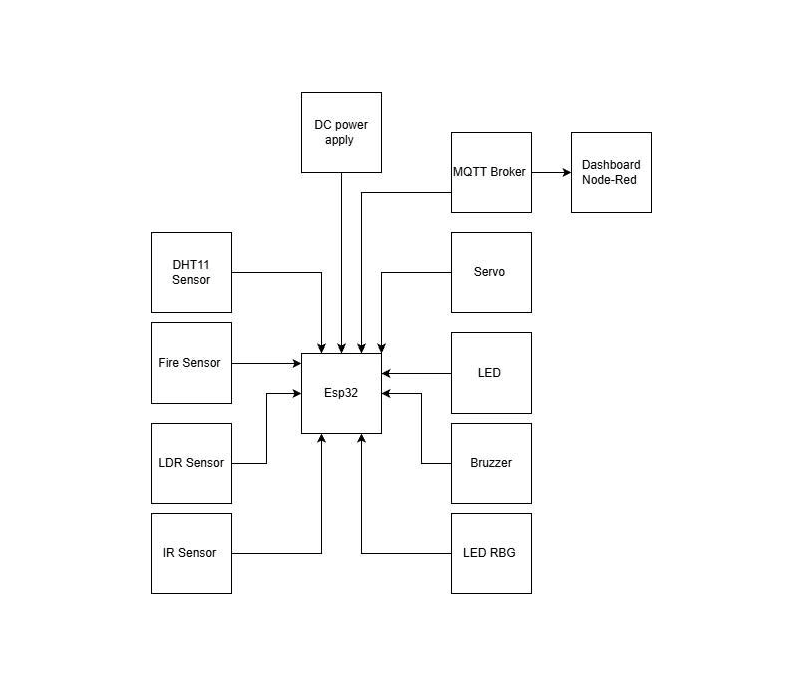
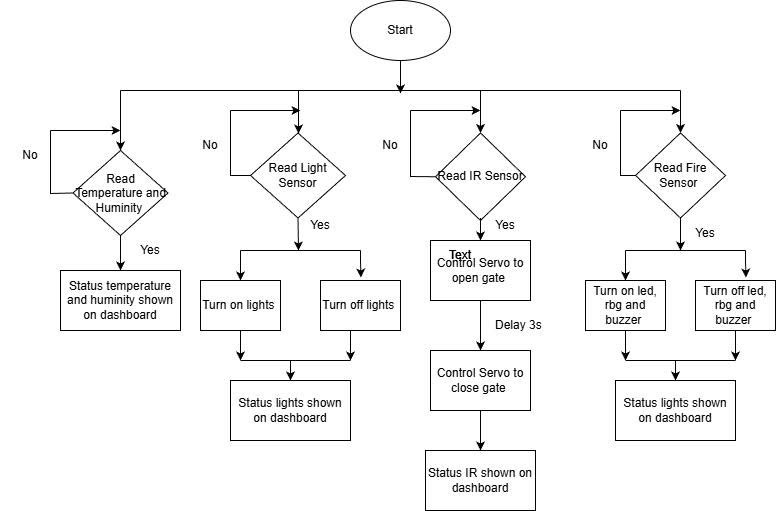
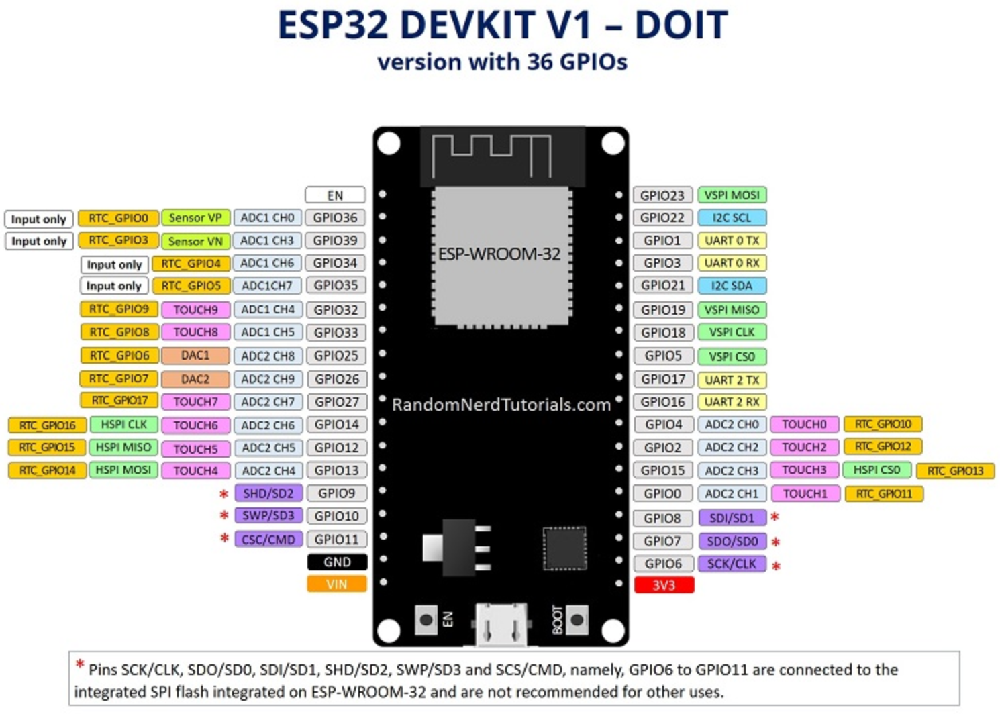
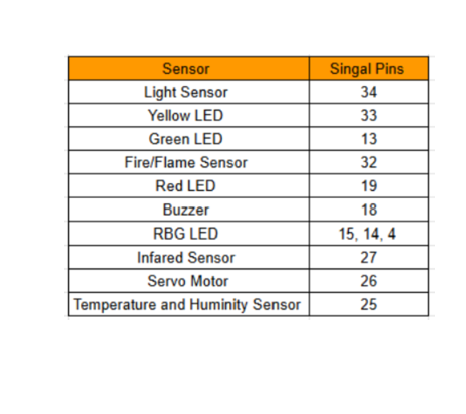
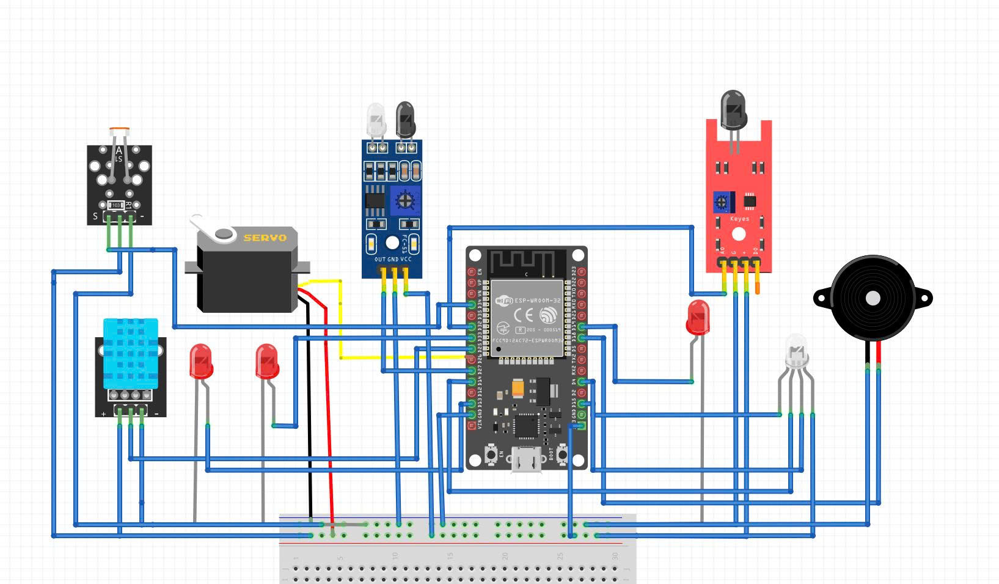
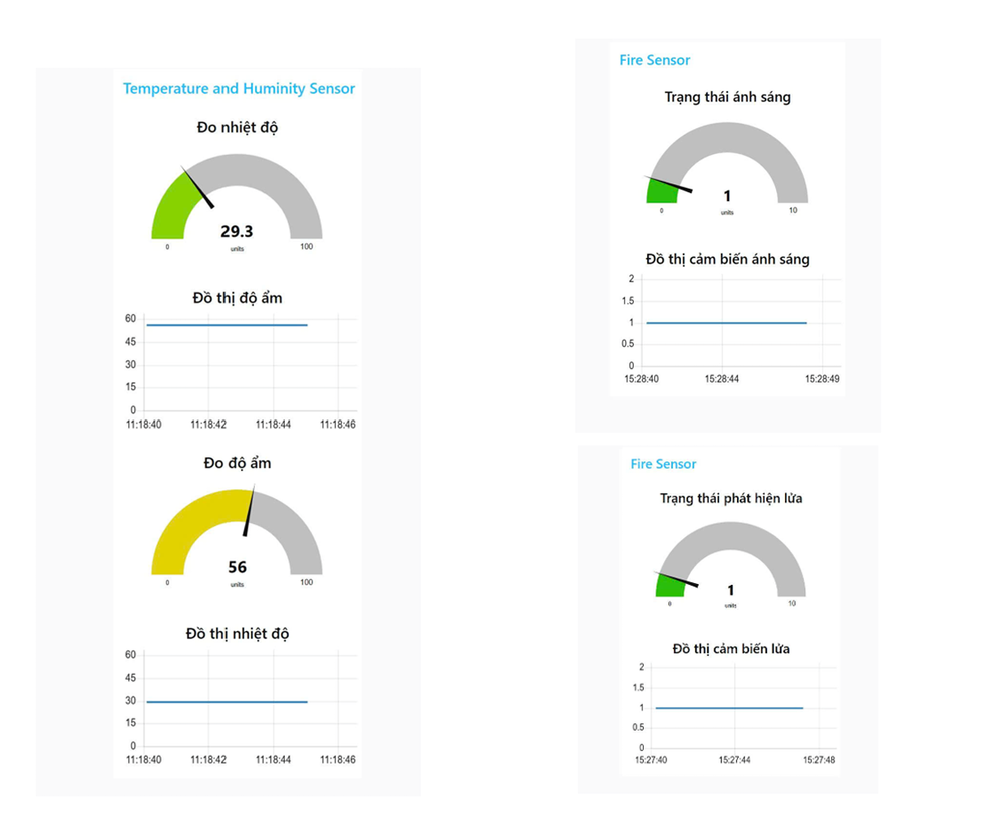
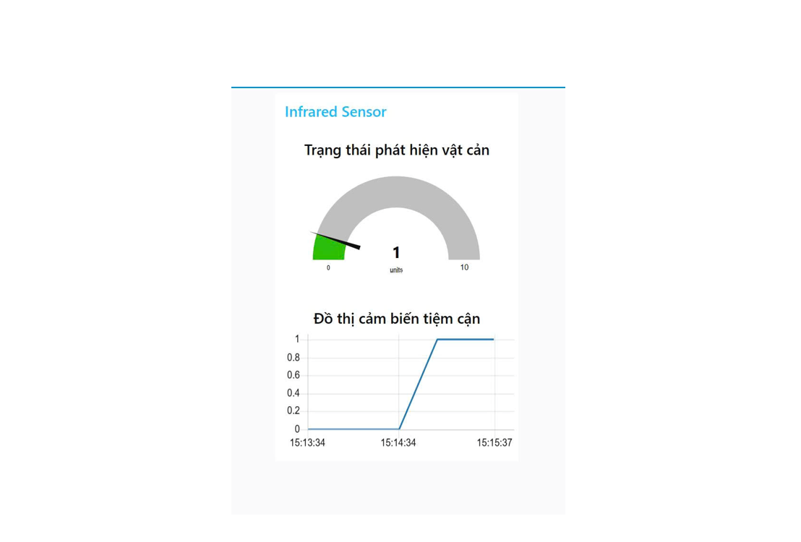

## Remote Home Monitoring System

## Project Overview
The Remote Home Monitoring System is an IoT-based solution designed to allow homeowners to monitor their house remotely. The system provides real-time environmental data, detects potential hazards, and enables control over devices like lights, ensuring safety and convenience.

## Problem Statement

Real-World Demand: Modern homes face potential hazards such as fires, and intrusions. Manual monitoring is inefficient and risky. There is a need for a smart monitoring system that:

- Detects environmental changes like temperature, humidity, light, and fire
- Detects presence or motion in critical areas
- Alerts occupants immediately through lights, buzzer, or RGB indicators
- Provides automated responses such as gate control

## Inspiration

- Fire and smoke incidents highlight the importance of early detection
- Basic home monitoring systems often lack integration and multi-sensor alerts
- This project provides a simple, cost-effective solution for home safety and automation

## Main Content 

1. Hardware Component 
- Microcontroller: MH-ET LIVE MiniKit for ESP32: Main microcontroller for processing sensor data
- DHT11 Sensor: Measures temperature and humidity
- IR Sensor: Detects motion or presence in monitored areas
- Flame Sensor: Detects fire or flames
- LDR Sensor: Measures ambient light for lighting control from led norm
- Servo Motor: Opens or closes gates automatically
- LEDs (3 x normal): Visual indicators for different statuses
- RGB LED: Warning indicator for critical hazards
- Buzzer: Audio alert for hazards

2. Software Component 
- Platform I/O: Development environment for programming ESP32
- Node-Red: displays data from DHT11, IR, Flame, and Light sensor on a dashboard, allowing remote monitoring of home environment
- MQTT Broker (EMQX): Communication between sensors and dashboard

## System Concept 

1. Model Idea
- Overall House Structure: The system simulates a house with an automatic gate and 3 main rooms – living room, bedroom, and kitchen 
- Gate Control: A proximity/IR sensor near the entrance detects objects or people and automatically triggers a servo motor to open or close the gate 
- Kitchen: Integrated with a flame sensor for fire detection and equipped with red LED warning lights that blink in case of fire 
- Living Room: 
    - Integrated with a DHT11 sensor to monitor temperature and humidity
    - Equipped with a light sensor to monitor ambient brightness.
    - Equipped with normal LEDs, RGB LED, and buzzer for hazard or emergency alerts
- Bedroom: Equipped with LED acting as night light, controlled by the light sensor when it gets too dark

2.  Gate Control
- When the IR/proximity sensor detects an object or person at the entrance, the servo motor automatically opens the gate 
- After the object passes, the gate automatically closes 

3. Lighting Control
- When ambient light is low, the LDR sensor triggers 2 LEDs to turn on, illuminating the room automatically 

4. Fire Detection and Alarm
- When the Flame sensor detects fire, the buzzer sounds an alarm 
- A normal LED blinks to indicate fire detection
- The RGB LED flashes to indicate a critical emergency

5. Environmental Monitoring
- The DHT11 sensor continuously measures temperature and humidity inside the house
- Data can be displayed on the dashboard via Node-RED for monitoring

## Block Diagram 
1. Block diagram  

2. Algorithm Flowchart  

# Connection table with ESP32 pins 
Below is the ESP32 pinout and its signal connections with the modules in the system:

1. ESP32 Pinout  

2. Connection table with ESP32 pins 
ESP32 pinout connected to the modules in the system:  

## Pin Diagram  
The pin diagram is simulated using Fritzing software  

## Result 
1. Model
The following figure shows the architecture of the model:

2. Node-red Dashboard  
- Remote Monitoring via Dashboard: Use the Node-Red dashboard to remotely monitor and control the system in real time.

- Environmental Monitoring in Main Rooms:
    - Monitor temperature and humidity to detect abnormal environmental conditions 
    - Measure ambient light levels to identify environmental changes or unexpected lighting conditions
    - Detect flame or fire events and evaluate their severity for safety responses

- Automated Gate Control: 
    - Use proximity sensors combined with servo motors to recognize movement patterns 
    - Detect unusual activity for gate automation 

## Video Demo 
Let's see my IoT project in action!  
https://bit.ly/IoTProject2025
